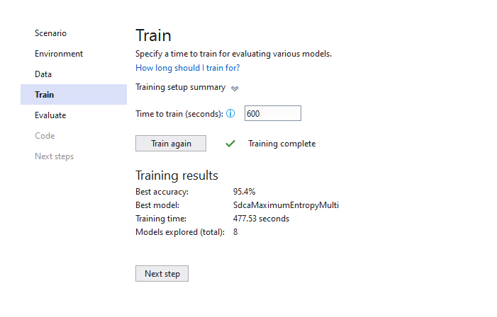

# SentimentAnalysisExample

The dataset and many parts in this readme.md are based on [https://github.com/dotnet/machinelearning-samples/blob/master/samples/csharp/getting-started/BinaryClassification_SentimentAnalysis](https://github.com/dotnet/machinelearning-samples/blob/master/samples/csharp/getting-started/BinaryClassification_SentimentAnalysis)

| ML.NET version | API type | Status| App Type | Data type | Scenario | ML Task | Algorithms |
|----------------|-------------------|-------------------------------|-------------|-----------|---------------------|---------------------------|-----------------------------|
| v1.4|   | Dynamic API | up-to-date | Console app | .txt file based on .tsv file | Sentiment Analysis | Two-class  classification | Linear Classification |

## Problem

This problem is centered around predicting if a customer's review has positive or negative sentiment. We will use small wikipedia-detox-datasets (one dataset for training and a second dataset for model's accuracy evaluation) that were processed by humans and each comment has been assigned a sentiment label: 
* 0 - nice/positive
* 1 - toxic/negative

## Result

| Trainer | MicroAccuracy | MacroAccuracy | Duration | #Iteration |
| --- | --- | --- | --- | --- |
|1 | AveragedPerceptronOva | 0.9486 | 0.8052| 29.7 | 1 |
|2 | SdcaMaximumEntropyMulti | 0.9540 | 0.8082 | 27.0| 2 |
|3 | LightGbmMulti | 0.9494 | 0.8036 | 89.3 | 3 |
|4 | SymbolicSgdLogisticRegressionOva | 0.9467 | 0.8196 | 29.5 | 4|
|5 | FastTreeOva | 0.9477 | 0.7871 | 180.4 | 5 |
|6 | LinearSvmOva | 0.9511 | 0.8241 |24.3 | 6 |
|7 | LbfgsLogisticRegressionOva | 0.9535 | 0.8183| 65.4 | 7|
|8 | SgdCalibratedOva | 0.9494 | 0.7871 | 31.9 | 8|

### Experiment Results

|                                                     Summary                                                    |
|----------------------------------------------------------------------------------------------------------------|
|ML Task: multiclass-classification                                                                              |
|Dataset: D:\GitHub\SentimentAnalysisExample\wikiDetoxAnnotated40kRows.txt                                       |
|Label : Label                                                                                                   |
|Total experiment time : 477.5336684 Secs                                                                        |
|Total number of models explored: 8                                                                              |

### Top 5 models explored 

| Trainer | MicroAccuracy | MacroAccuracy | Duration | #Iteration |
| --- | --- | --- | --- | --- |
|1 | SdcaMaximumEntropyMulti | 0.9540 | 0.8082 | 27.0 | 1 |
|2 | LbfgsLogisticRegressionOva | 0.9535 | 0.8183 | 65.4 | 2 |
|3 | LinearSvmOva | 0.9511 | 0.8241 | 24.3 | 3 |
|4 | LightGbmMulti | 0.9494 | 0.8036 | 89.3 | 4 |
|5 | SgdCalibratedOva | 0.9494 | 0.7871 | 31.9 | 5 |

